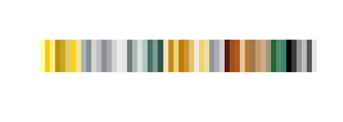
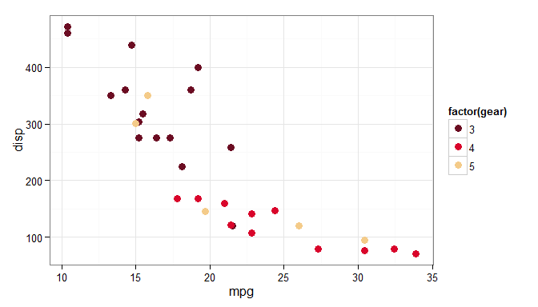

[](https://travis-ci.org/hrbrmstr/swatches)

`swatches` is a package to read (and eventually write) palette (ACO/ASE/GPL) files

In *Envisioning Information*, Edward Tufte says *"…avoiding catastrophe becomes the first principle in bringing color to information: Above all, do no harm."* R users gain a quick upper hand in adhering to this "do no harm" thanks to sane defaults in `ggplot2` and packages like [ggthemes](http://cran.r-project.org/web/packages/ggthemes/index.html) and [RColorBrewer](http://cran.r-project.org/web/packages/RColorBrewer/index.html) that enable use of established, good color palettes.

If you do visualization work in conjunction with a design shop or organization that establishes their own palettes and themes there will often be standard palettes that must be adhered to. These are usually stored and shared in some type of Adobe swatch file format. There are also many sites like [Adobe Color CC](https://color.adobe.com/) and [COLOUR Lovers](http://www.colourlovers.com/) where folks can create and share color palettes. Plus, there are thousands of other palette files in dozens of palette formates.

This package enables you to use the colors straight from `.ase`, `.aso`, `.gpl`, `.soc` or `.color` files and avoid the cutting/pasting of hex codes or using color pickers to extract the color information. You can read these swatch files directly from the internet and/or include the files directly in your R projects. This will make it easier to modify a resource versus change code.

NOTE that just beacuse an ASE, ACO, GPL, SOC or color file exists on the internet does *not* mean that it will let you "do no harm". You still need to use good judgement from knowledge/experience (or advice from experts) to ensure you are using colors effectively. This package just opens up the world of colors in R a little bit more.

The following functions are implemented:

-   `read_aco` : Read colors from Adobe Color (ACO) files
-   `read_ase` : Read colors from Adobe Swatch Exchange (ASE) files
-   `read_gpl` : Read GIMP Palette (GPL) files
-   `read_soc` : Read OpenOffice palette (SOC) files
-   `read_kde` : Read KDE Palette (colors) files
-   `show_palette` :Display a color palette

### TODO

-   Grayscale support (just need to find or gen Grayscale ASE/ACO files, if you have a few please hook me up)
-   LAB support (could use some help with this)
-   Writing out ACO or ASE files (not sure this is needed, tho)

### News

-   Version `0.1` released
-   Version `0.2` released : ACO v2 support
-   Version `0.3` released : GIMP Palette (GPL) format support, KDE Palette (colors) and OpenOffice palette (SOC) format

### Installation

``` r
devtools::install_github("hrbrmstr/swatches")
```

### Usage & Exposition

``` r
library(swatches)

# current verison
packageVersion("swatches")
```

    ## [1] '0.3'

One good source for palettes is the ["Most Popular" section](https://color.adobe.com/explore/most-popular/?time=all) on Adobe Color CC. If you use the Adobe ecosystem, you can sync ASE palette files directly locally or download them directly (registration required).


The "Herbs and Spice" and "Keep the Change" palettes are kinda nifty, and also included in this package (since Adobe has yet to release the new API for the color site for automatic downloading). We can take a quick look at both of them. Here they are from the web site:


And, there they are via this package:

``` r
herbs_and_spice <- read_ase(system.file("palettes", "herbs_and_spice.ase", package="swatches"))
print(herbs_and_spice)
```

    ##                                                   
    ## "#5A1F00" "#D1570D" "#FDE792" "#477725" "#A9CC66"

``` r
show_palette(herbs_and_spice)
```


``` r
keep_the_change <- read_ase(system.file("palettes", "keep_the_change.ase", package="swatches"))
print(keep_the_change)
```

    ##                                                   
    ## "#6B0C22" "#D9042B" "#F4CB89" "#588C8C" "#011C26"

``` r
show_palette(keep_the_change)
```


As said earlier, you can also read directly from a URL. Here is a "metal" palette ripped straight [from github](https://github.com/picwellwisher12pk/en_us/):

``` r
metal <- read_ase("https://github.com/picwellwisher12pk/en_us/raw/master/Swatches/Metal.ase")
print(metal)
```

    ##      C=0 M=0 Y=30 K=0     C=2 M=20 Y=94 K=0      C=0 M=6 Y=47 K=0 
    ##             "#ffffb3"             "#fbcc0f"             "#feef89" 
    ##    C=20 M=40 Y=96 K=7    C=16 M=32 Y=82 K=5     C=4 M=14 Y=60 K=8 
    ##             "#bf9009"             "#cba62c"             "#e2cc5e" 
    ##     C=1 M=19 Y=90 K=0      C=0 M=5 Y=42 K=5      C=8 M=4 Y=3 K=27 
    ##             "#fccf1b"             "#f2e78c"             "#acb3b5" 
    ##     C=17 M=8 Y=5 K=39      C=2 M=0 Y=4 K=16      C=6 M=7 Y=4 K=22 
    ##             "#829094"             "#d2d7ce"             "#bdbbc1" 
    ##    C=11 M=13 Y=8 K=38      C=8 M=9 Y=6 K=28      C=3 M=4 Y=3 K=14 
    ##             "#8d8a91"             "#a9a7ad"             "#d3d2d5" 
    ##       C=1 M=1 Y=1 K=7       C=4 M=3 Y=3 K=7    C=18 M=8 Y=10 K=48 
    ##             "#ececed"             "#e3e6e6"             "#6e7c79" 
    ##     C=10 M=5 Y=6 K=24    C=17 M=11 Y=13 K=0    C=31 M=24 Y=25 K=0 
    ##             "#b0b9b7"             "#d5e3de"             "#b0c4c0" 
    ##   C=64 M=47 Y=52 K=19    C=51 M=37 Y=40 K=4   C=71 M=53 Y=57 K=32 
    ##             "#4a6e64"             "#7a9c94"             "#33524b" 
    ##      C=0 M=7 Y=24 K=5    C=18 M=43 Y=89 K=7   C=1 M=12 Y=50 K=6 1 
    ##             "#f3e3bb"             "#c4871b"             "#edd378" 
    ##   C=21 M=49 Y=100 K=7    C=16 M=38 Y=79 K=6     C=0 M=19 Y=54 K=8 
    ##             "#bd7a00"             "#ca9434"             "#ebbf6c" 
    ##      C=0 M=5 Y=15 K=4     C=1 M=12 Y=50 K=6      C=1 M=8 Y=32 K=5 
    ##             "#f5e9d1"             "#edd378"             "#f1dea4" 
    ##      C=6 M=4 Y=3 K=39    C=5 M=4 Y=2 K=29 1      C=3 M=3 Y=1 K=16 
    ##             "#939697"             "#acadb0"             "#d1d1d4" 
    ##   C=39 M=83 Y=92 K=42 C=22 M=57 Y=86 K=23 1    C=0 M=52 Y=86 K=29 
    ##             "#5a190d"             "#99551c"             "#b6581a" 
    ##   C=0 M=15 Y=36 K=9 1  C=6 M=39 Y=74 K=22 1   C=25 M=43 Y=65 K=17 
    ##             "#e9c695"             "#ba7934"             "#9f794b" 
    ##   C=14 M=32 Y=51 K=11    C=0 M=21 Y=35 K=17   C=33 M=31 Y=46 K=11 
    ##             "#c49a6f"             "#d4a88a"             "#999c7a" 
    ##   C=76 M=41 Y=68 K=35    C=67 M=42 Y=54 K=5    C=78 M=45 Y=56 K=3 
    ##             "#296335"             "#518d70"             "#36876c" 
    ##     C=0 M=0 Y=0 K=100    C=0 M=0 Y=0 K=78 1    C=0 M=0 Y=0 K=42 1 
    ##             "#000000"             "#3a3a3a"             "#949494" 
    ##    C=0 M=0 Y=0 K=26 1    C=0 M=0 Y=0 K=66 1    C=0 M=0 Y=0 K=10 1 
    ##             "#bdbdbd"             "#565656"             "#e6e6e6" 
    ##       C=0 M=0 Y=0 K=0 
    ##             "#ffffff"

``` r
show_palette(metal)
```



As you can see, this "metal" palette actually had named colors (albeit bland, CMYK value names).

Some palettes, like the Omega Nebula (CC-BY-SA [davidgav](http://www.colourlovers.com/lover/davidgav/loveNote)) one included with the package, have license restrictions (the mind *boggles*), so be aware of that when blatantly using others' designs without attribution. David's palette has much better names:

``` r
omega_nebula <- read_ase(system.file("palettes", "omega_nebula.ase", package="swatches"))
print(omega_nebula)
```

    ## distance between             Pale             Clay  Snow forest III 
    ##        "#9D7E79"        "#CCAC95"        "#9A947C"        "#748B83" 
    ##       Aqua Smoke 
    ##        "#5B756C"

``` r
show_palette(omega_nebula)
```


For some reason (I haven't poked at the source code yet or talked to @hadleywickham), ggplot `scale_*_manual` (color/fill)'s do *not* like named color vectors. So you need to use `unname` (or `use_names=FALSE` in `read_ase` or `read_aco`) before using them as `values`:

``` r
library(ggplot2)
gg <- ggplot(mtcars, aes(x=mpg, y=disp))
gg <- gg + geom_point(aes(col=factor(gear)), size=3)
gg <- gg + scale_color_manual(values=unname(keep_the_change))
gg <- gg + theme_bw()
gg
```



### Test Results

``` r
library(swatches)
library(testthat)

date()
```

    ## [1] "Mon Mar 23 17:24:15 2015"

``` r
test_dir("tests/")
```

    ## basic functionality :
